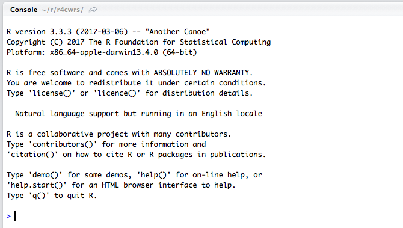

# Basic R

When you open RStudio, you are presented with the ominous `>` of the R console. By the end of this tutorial, hopefully that `>` should fill you with a feeling of hope and opportunity, for magical things can happen when you type the right thing after the `>`. This short introduction will get you started with the R console so that when we introduce more powerful functions, you can understand what R is doing at the base level! The tutorial is loosely based on the [Workflow: basics](http://r4ds.had.co.nz/workflow-basics.html) tutorial in the free online book, [R for Data Science](http://r4ds.had.co.nz/) [@r4ds].



## Prerequisites

The prerequisite for this tutorial is the `tidyverse` package. If this package isn't installed, you'll have to install it using `install.packages()`, which you can type after the `>`.

```{r, eval = FALSE}
install.packages("tidyverse")
```

Load the packages when you're done! If there are errors, you may have not installed the above packages correctly!

```{r}
library(tidyverse)
```

## Expressions and Variables

Let's start with the basics. Try typing in something like this at the prompt:

```{r}
1 + 1
```

```{r}
2 * 5
```

```{r}
5 ^ 2
```

```{r}
2 * (5 + 1)
```

As you can see, R works just like a calculator and evaluates all of these **expressions** just like you would expect. If we would like to save the result of one of these expressions we can assign that value to a **variable** like this:

```{r}
x <- 1 + 1
```

Then, to view the value of `x` we can just type `x` at the console, and R will show us the value.

```{r}
 x
```

The `<-` means "assign the value on the right to the variable on the left". We can also use `x` in any expression and R will substitute its value in like this:

```{r}
x + 2
```

An **expression** is something that R can evaluate to produce a value, like `2+2` or `x + 2`. Any time you type this in the console without assigning it to a **variable**, R will print out the value. In fact, any time you type anything into the R console, R is evaluating that expression, which may or may not return a value. If there is no value returned, R won't print anything when you press enter.

So far we've just used numbers, but often we need to enter text into R. Whenever we do this, we surround the text in quotes, like this:

```{r}
mytext <- "I am text"
```

Text (called **character** vectors) are one of many data types available in R.

## Functions

A function is some kind of operation that takes one or more **arguments** (input values) and produces a **return value** (output value). The `sqrt()` function is a good example:

```{r}
sqrt(4)
```

Here, `4` is an **argument**, and the function **returns** the square root of that, which is `2`. Functions can take more arguments, like the `max` function:


```{r}
max(2, 6, 7, 2, 10)
```

Here we are giving the `max` function 5 arguments, of which it returns the maximum. One other way we specify arguments is by **keyword arguments**, like in the `paste` function.


```{r}
paste("string1", "string2", sep = "_")
```

The `paste` function takes its arguments and combines them using the `sep` that we specify, in this case `"_"`. The function **returns** this string. Many functions in R have many many arguments and usually we only want to modify one or two of interest to us. The format is always `key=value`, where `key` is the name of the keyword and `value` is some **expression** we would like to use as the value for that argument.

R contains thousands of functions that do most of what you could possibly imagine with regards to data and statistics, but remembering which one you want and how to use it can be difficult. Luckily, RStudio makes it easy using tab autocompletion and easy access to help files. To autocomplete, start typing the name of the function and press the `[Tab]` key (or `Ctrl+Space`), and RStudio will helpfully provide you with suggestions.

To access the documentation for a particular function, you can type `?` in front of the function name and press return, and RStudio will open the help file for you if it exists.

```{r, eval = FALSE}
?paste
```

Will bring up the following:


> #### Description

> Concatenate vectors after converting to character.

> #### Usage
>
> ```
paste (..., sep = " ", collapse = NULL)
paste0(..., collapse = NULL)
```
>
> #### Arguments
> <table><tr valign="top"><td><code>...</code></td><td><p>one or more <span style="font-family: Courier New, Courier; color: #666666;"><b>R</b></span> objects, to be converted to character vectors.</p></td></tr><tr valign="top"><td><code>sep</code></td><td><p>a character string to separate the terms.  Not
<code><a href="NA.html">NA_character_</a></code>.</p></td></tr><tr valign="top"><td><code>collapse</code></td><td><p>an optional character string to separate the results.  Not
<code><a href="NA.html">NA_character_</a></code>.</p></td></tr></table>

Note that each of these **arguments** can be specified by **keyword**, and have default values that we can see in the **usage** section. The `...` means that we can pass any number of arguments to the function. There's too many functions in R to keep in your head at one time, so getting good at reading these help files is very useful!

## Vectors

So far we've just been dealing with single values like `2+2` or `"mystring"`, but the real power of R is that it can operate easily on large lists of data, so it makes sense that it provides us with an easy way to work with this data. These lists of data are called **vectors**, and we create them using the `c` function (`c` stands for **concatenate**, or join together).

```{r}
myvector <- c(10, 9, 8, 7, 2)
myvector
```

Here the `c` function took our **arguments** of 10, 9, 8, 7, and 2, and **returned** a **vector**, which we assigned to the variable named `myvector`. When we evaluated `myvector`, it printed out the list of values it contained.

Vectors don't just have to contain numbers, they can contain strings as well.

```{r}
mytextvector <- c("word1", "word2", "word3")
mytextvector
```

Here the `c` function took our **arguments** and **returned** a **vector** of strings, which we assigned to the variable `mytextvector`.

It is common to have to generate a vector of all the integer values between two numbers, so R provides a short form for this:

```{r}
1:10
```

```{r}
20:12
```

```{r}
myothervector <- 13:16
myothervector
```

You can also use an **expression** on either side of the `:`, like this:

```{r}
(5^2):(3*10)
```

```{r}
start <- 25
end <- start + 5
start:end
```

## Indexing

Now we've created vectors, but to get at what's inside them we need to retrieve values using an **index**. We do this using square brackets like this:

```{r}
myvector <- c(10, 9, 8, 7, 2)
myvector[1]
```

```{r}
myvector[5]
```

```{r}
myvector[3]
```

This code creates a vector, assigns it to the variable `myvector`, then retrieves the 1st, 5th, and 3rd value stored in that vector. If we would like multiple values from the vector, we can pass multiple values as indices, like this:

```{r}
myvector[c(1, 5, 3)]
```

You'll notice that the index that we're using is actually a vector itself! I know, we're using a vector to index a vector and it's a little trippy, but it's incredibly useful. You'll remember that we can easily create vectors of sequential integers, which we can use to get a sequence of values from a vector by using it as an index.

```{r}
 myvector[1:3]
```

This would be equivalent to:

```{r}
 myvector[c(1, 2, 3)]
```

There is one other useful way to index a vector using a vector, which is to use a `TRUE`/`FALSE` vector. This is probably the most useful of the indexing methods, because it allows you to do things like:

```{r}
myvector[myvector > 7]
```

This works because `myvector > 7` is, itself, a `TRUE`/`FALSE` vector with the same length as `myvector`, indicating whether or not it is greater than 7 at any given position.

```{r}
myvector > 7
```

## Missing Values

Missing values are represented in R using `NA`, or "not assigned". The fact that R handles missing values is one of the best reasons to use R for data analysis, because missing values are common in real data. `NA` values are propogated by R functions, meaning that if you take the `mean()` of a vector containing a missing value, it will give you `NA` as the average!

```{r}
mean(c(NA, 1, 2, 3))
```

This is rarely what you want, but is a good practice to explicitly handle missing values in your code, and R forces you to do this. To avoid getting an NA back, you can use `na.rm = TRUE`, an argument that is available in many R functions.

```{r}
mean(c(NA, 1, 2, 3), na.rm = TRUE)
```

## Data Frames

The vast majority of data in R is kept in a **tibble** (often called a **data frame**), which is a collection of **vectors** of the same length. You can think of a **tibble** as a table, with each column in the table being of the same type (numeric, character, TRUE/FALSE, etc.).

```{r}
my_tibble <- tibble(
  number = c(1, 2, 3), 
  name = c("one", "two", "three"),
  is_one = c(TRUE, FALSE, FALSE)
)
my_tibble
```

The syntax for creating a **tibble** is `tibble(column_name = value)`. The above tibble has three columns (`number`, a numeric column, `name`, a character column, and `is_one`, a logical TRUE/FALSE column). You can get these values as vectors again using the `$` operator, which allows you to extract a vector from a data frame.

```{r}
my_tibble$number
```

```{r}
my_tibble$name
```

```{r}
my_tibble$is_one
```

You can think of tibbles as a collection of vectors (**variables**) having the same number of elements. The number of elements has to be equal for all columns, meaning the *i*^th^ value of each vector forms an **observation**. Data in this form is very useful and is the subject of most of the following tutorials.

## Loading Packages

Basic R functionality is designed to provide basic functions to help with data analysis, but may add-ons are available and code you find online (including here, shortly) will often tell you to load a "package" using `library()`. This will be a call to the `library()` function in the form `library(packagename)`, where `packagename` is the name of the package which contains the functions you are interested in using (all of the subsequent tutorials will use `library(tidyverse)`, because the `tidyverse` package contains many useful functions that you will use on a regular basis. When you call `library(packagename)`, it will make these functions available to you. Occasionally you will see something like `packagename::function_name()`, which is a method to use a function without making *all* of the functions in a package. This is equivalent to typing `library(packagename)` then `function_name()` on the next line. You can install packages using `install.packages("packagename")` (note the quotes around `packagename`!).

For example, let's install the `tidyverse` package now, since you'll be using it in the rest of this series.

```{r, eval = FALSE}
install.pacakges("tidyverse")
```

Then, load it using `library()`:

```{r}
library(tidyverse)
```

Finally, we are ready to call a function from the package. The `tidyverse` package actually installs and loads a family of useful packages for us, a list of which we can access using `tidyverse_packages()`. Try it!

```{r}
tidyverse_packages()
```

## Using the Script Editor

In reality, very little of the code you type will be directly in the prompt. Instead, you will use RStudio's script editor to run commands so that you can go back and edit them or run them from the beginning. To create a new R script, choose *File*, *New File*, and *R script* (you can also choose the little green "+" button at the top left of the console window). A blank R script should appear in a new tab.


When you type a command in the editor and press enter, nothing happens! This is because the editor is meant to build script that contain multiple lines, unlike the console, which is meant to execute a single line at a time. To run a command you have typed in the script editor, press Ctrl+Enter (Command+Enter on a Mac). You can even select multiple lines, press Ctrl+Enter, and they will all run at once! You can also save the script and choose *Source* to run the whole thing. It is good practice to keep all of your code in a script somewhere. Typing it on a console repeatedly is hard work, and leads to errors! 

## The Environment

When you've assigned a bunch of variables, it can be tricky to keep track of which ones are where and contain what! Hopefully you have given them short but descriptive names, but if you happen to forget you can check the "Environment" tab in RStudio (in the upper right part of the window). If you'd like to start fresh you can clear the environment (use the little broom icon or go to Session/Clear Workspace), and if you *really* want to start fresh, you can restart R using Session/Restart R. This will clear your workspace and unload all the packages you loaded using `library()`. This is a good way to make sure all of your analysis has been encapsulated by the script, since you can Restart R and *Source* your script to replicate your work.


By default, R will save your session when you quit and reload the variables you had previously assigned when you reopen it. This is dangerous, because even though you created an object, you may not be able to create it again! I highly reccomend using the script editor to encapsulate all of your code, and disable the automatic loading/saving of your workspace. You can do this in RStuio's Preferences (or "Global Options" on Windows/Linux) by setting "Save workspace on exit" to "Never", and unchecking "Restore .RData into workspace at startup".


## Excercises

To practice the basics of R, complete the very first [swirl](http://swirlstats.com/) module, R Programming / Basic Building Blocks. To do this, you'll need to install and load **swirl** by typing this at the R prompt:

```{r, eval = FALSE}
install.packages("swirl")
library(swirl)
swirl()
```

You should get a friendly greeting that will prompt you to choose a course (you want number 1, "R Programming: The basics of programming in R") and a module (you want number 1, "Basic Building Blocks"). I suggest stopping after the first module, as [R for Data Science](http://r4ds.had.co.nz/) provides a more effective introduction to the language.

## Summary

In this lesson we covered **expressions**, **variables**, **functions**, **vectors**, and **indexing**, all of which will help you get the most out of the tutorials in this series. For more information, check out the [Workflow: basics](http://r4ds.had.co.nz/workflow-basics.html) and [Workflow: scripts](http://r4ds.had.co.nz/workflow-scripts.html) tutorial in the free online book, [R for Data Science](http://r4ds.had.co.nz/).
