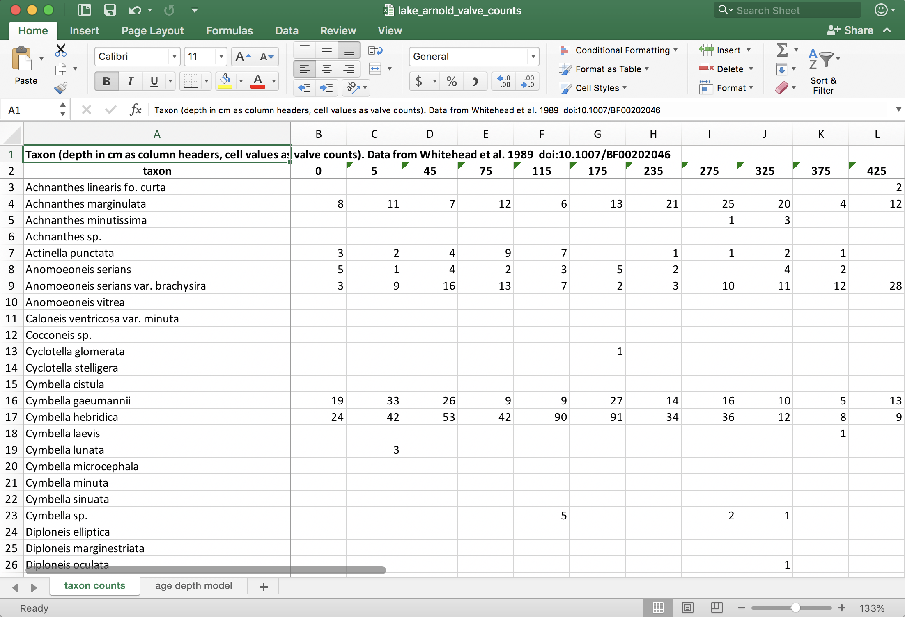

# Preparing and Loading Data {#prepare-load}

Intro

Draws from [data transformation](http://r4ds.had.co.nz/transform.html), [tidy data](http://r4ds.had.co.nz/tidy-data.html) and [data import](http://r4ds.had.co.nz/data-import.html) from [R for Data Science](http://r4ds.had.co.nz/) [@r4ds].

## Prerequisites

The prerequisites for this tutorial are `tidyverse`. If this package isn't installed, you'll have to install it using `install.packages()`.

```{r, eval = FALSE}
install.packages("tidyverse")
```

Load the package when you're done! If there are errors, you may have not installed the above packages correctly!

```{r}
library(tidyverse)
```

Finally, you will need to obtain the example data. In this tutorial, we will use [Lake Arnold](https://www.google.com/maps/place/Lake+Arnold/@44.1305679,-73.9831746,11714m/data=!3m1!1e3!4m5!3m4!1s0x4ccaddaff2a5e819:0x392dc3e7c14fb40f!8m2!3d44.1310666!4d-73.9440977) diatom counts [@whitehead89], obtained from the [Neotoma database](https://www.neotomadb.org/). You will need to download the [tidy CSV version of the data](data/lake_arnold_valve_counts_tidy.csv), and the [Excel version of the data](data/lake_arnold_valve_counts.xlsx).

```{r fig-arnold-excel, fig.cap = "Excel screenshot of the Lake Arnold data. The format of one row per taxon with one column per sample is one way that these data are organized in the wild."}

```

## Loading data

If data are in a CSV, use `read_csv()`:

```{r}
arnold_counts_csv <- read_csv("data/lake_arnold_valve_counts_tidy.csv")
```

The function will guess all the column types, which you can copy and paste into your read call like this:

```{r}
arnold_counts_csv <- read_csv(
  "data/lake_arnold_valve_counts_tidy.csv",
  col_types = cols(
    .default = col_integer()
  )
)
```

This will make sure that your column types are read properly in the future, and if any columns are guessed incorrectly, they can be fixed here. For more see the [data import](http://r4ds.had.co.nz/data-import.html) chapter of @r4ds.

We will revisit the `arnold_counts_csv` data frame shortly. It contains the data in the form expected by many R functions, particularly for ordination/transfer function calculations, however it is more common to see the data in a form shown in Figure \@ref(fig:fig-arnold-excel). If data are in an Excel sheet, we can use the **readxl** package. This package is installed with the tidyverse, but you need to load it explicitly to use the `read_excel()` function.

```{r}
library(readxl)

arnold_counts_excel <- read_excel(
  "data/lake_arnold_valve_counts.xlsx",
  sheet = "taxon counts",
  skip = 1
)
```

## Transforming data

`gather()`:

```{r}
arnold_counts_excel %>%
  gather(key = depth_cm, value = valve_count, -taxon)
```

Change type of depth column:

```{r}
arnold_counts_excel %>%
  gather(key = depth_cm, value = valve_count, -taxon) %>%
  mutate(depth_cm = as.numeric(depth_cm))
```

Change `NA` valve counts to 0:

```{r}
arnold_counts_excel %>%
  gather(key = depth_cm, value = valve_count, -taxon) %>%
  mutate(depth_cm = as.numeric(depth_cm)) %>%
  mutate(valve_count = if_else(is.na(valve_count), 0, valve_count))
```


This form of data is particularly useful because it contains one row per measurement, and looses no data. When finished constructing the pipe, assign to a variable:

```{r}
arnold_counts <- arnold_counts_excel %>%
  gather(key = depth_cm, value = valve_count, -taxon) %>%
  mutate(depth_cm = as.numeric(depth_cm)) %>%
  mutate(valve_count = if_else(is.na(valve_count), 0, valve_count))
```

Things we can do with the data in this form:

Use a grouped mutate to calculate relative abundance:

```{r}
arnold_rel_abund <- arnold_counts %>%
  group_by(depth_cm) %>%
  mutate(relative_abundance_percent = valve_count / sum(valve_count) * 100) %>%
  ungroup()

arnold_rel_abund
```

Summarise by taxon, find most common taxa:

```{r}
arnold_rel_abund %>%
  group_by(taxon) %>%
  summarise(
    min_rel_abund = min(relative_abundance_percent),
    max_rel_abund = max(relative_abundance_percent),
    mean_rel_abund = mean(relative_abundance_percent)
  ) %>%
  arrange(desc(max_rel_abund))
```

Summarise by depth, find depths with greatest richness:

```{r}
arnold_rel_abund %>%
  group_by(depth_cm) %>%
  summarise(
    n_valves = sum(valve_count),
    total_rel_abund = sum(relative_abundance_percent),
    n_taxa = sum(valve_count > 0)
  )
```

Create form of data with one row per depth value (this is almost the same as the `arnold_counts_csv` that we loaded earlier):

```{r}
arnold_rel_abund %>%
  select(taxon, depth_cm, relative_abundance_percent) %>%
  spread(key = taxon, value = relative_abundance_percent)
```

Use a left-join to add age-depth info:

```{r}
arnold_age_depth <- read_excel(
  "data/lake_arnold_valve_counts.xlsx",
  sheet = "age depth model",
  skip = 1
)

arnold_rel_abund %>%
  left_join(arnold_age_depth, by = "depth_cm") %>%
  select(taxon, depth_cm, age_bp, everything())
```

Filter to only include some taxa:

Find common taxa:

```{r}
common_taxa <- arnold_rel_abund %>%
  group_by(taxon) %>%
  summarise(
    max_rel_abund = max(relative_abundance_percent)
  ) %>%
  filter(max_rel_abund >= 20) %>%
  pull(taxon)

common_taxa
```

Filter the counts:

```{r}
arnold_rel_abund %>%
  filter(taxon %in% common_taxa)
```

## Exporing data

- use write_csv, writexl::write_xlsx, to write output

## Summary

Tutorial summary

Draws from [data transformation](http://r4ds.had.co.nz/transform.html) and [data import](http://r4ds.had.co.nz/data-import.html) from [R for Data Science](http://r4ds.had.co.nz/).
